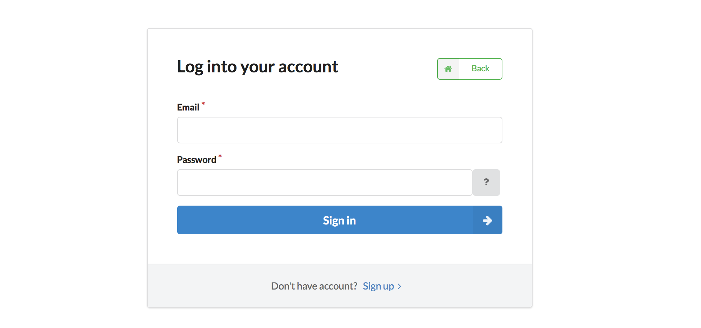
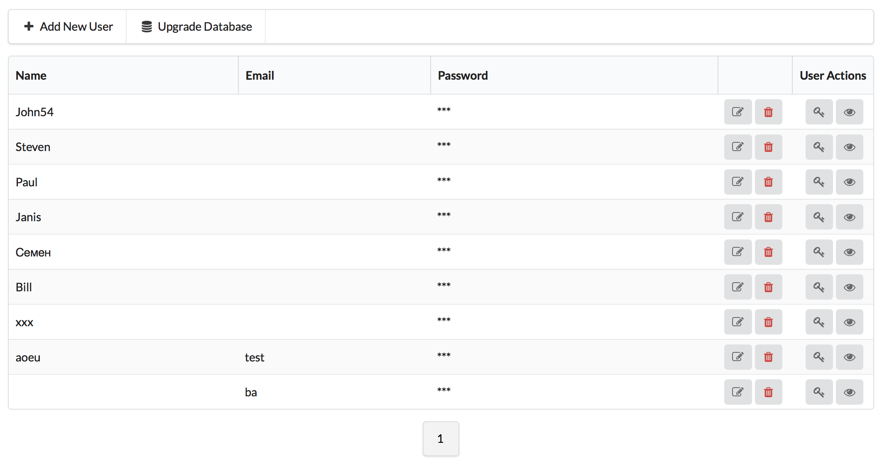

Many PHP projects require some sort of authentication before user can access certain areas of the application. 

This project implements User Access Control by leveraging [Agile UI](https://github.com/atk4/ui) and [Agile Data](https://github.com/atk4/data) frameworks.


Here are all the classes implemented:

-   Field\Password - password hashing, safety, generation and validation
-   Model\User - basic user entity that can be extended
-   LoginForm - username/password login form
-   RegisterForm - registration form
-   Auth - authentication controller, verify and record logged state
-   UserAdmin - UI for user administration
-   Layout\Narrow - SemanticUI-based narrow responsive layout login/registration forms
-   Templates for forms an messages
-   Demos for all of the above

Each component must be manually activated in your project. 

1.  `$app = new \atk4\ui\App()` - use generic App class or framework-specific integration
2.  Look up code below to activate certain component
3.  Integrate with the rest of your project using example code

### Installation

Install through composer (`composer require atk4\login`) then use this code:

``` php
$app->auth = $app->add(new \atk4\login\Login();
$app->auth->setModel(new \atk4\login\User($app->db));
```

See `demos/db.php` for example usage. The above will have no impact, but will enable you to use other components.

### Usage

There are two modes of operation - Automated and Manual. Automated handles display of forms based on currently logged state automatically when you run: `auth->check()` - most suitable for protecting "Admin" systems.  **Only MANUAL mode is currently implemented (v0.9)**

For manual page you would need to manually place some PHP code inside your signup, login, admin and other pages. An extended usage example is offered in `demos/` folder.

1.  Download Agile Toolkit from www.agiletoolkit.org
2.  From console run `composer require atk4/login`
3.  Copy "demos" folder into "agiletoolkit" folder
4.  Copy "demos/config-example.php" to "demos/config.php" then edit

Works with MySQL, SQLite or any other data source supported by Agile Data.

#### Adding sign-up form

``` php
$app->add(new \atk4\login\RegisterForm())
    ->setModel(new \atk4\login\Model\User($app->db));
```

Displays email and 2 password fields (for confirmation). If filled successfully will create new record for `\atk4\login\Model\User`. Will cast email to lowercase before adding. Things to try:

-   Extend or use your own User class
-   Add more fields to registration form
-   Decorate registration form with message and links
-   Use multi-column form layout

#### Log-in form



``` php
$app->add([
  new \atk4\login\LoginForm(), 
  'auth'=>$app->auth,
  //'successLink'=>['dashboard'],
  //'forgotLink'=>['forgot'],
]);
```

Displays log-in form and associate it with $auth. When form is filled, will attempt to authenticate using $auth's model. If password is typed correctly, will redirect to "successLink" (which will be passed to $app->url()). Things to try:

-   Redirect to login page if not authenticated
-   Add 3rd party authentication (authenticate using 3rd party lib, look up connected account, store into auth persistence)
-   Implement two factor authentication (store flag in auth persistence indicating if 2nd factor is carried out, if not display it)
-   Implement password verification delay after several unsuccessful attempts
-   Ask user to change password if it is about to expire

#### Dashboard

To check if user is currently logged in:

``` php
if ($app->auth->model->loaded()) {
  // logged-in
}
```

Auth model stores user model data in session, so if you delete user from database, he will not be automatically logged out. To log-out user explicitly, call `$app->auth->logout()`.

You may also access user data like this: `$app->auth->model['name']`; Things to try:

-   Explicitly load user record from database instead of cache only
-   Store last login / last access time in database
-   Move auth cache to MemCache

#### Profile Form

This form would allow user to change user data (including password) but only if user is authenticated. To implement profile form use:

``` php
$app->add('Form')->setModel($app->auth->user);
```

Demos open profile form in a pop-up window, if you wish to do it, you can use this code:

``` php
$app->add(['Button', 'Profile', 'primary'])->on('click', $app->add('Modal')->set(function($p) {
    $p->add('Form')->setModel($p->app->auth->user);
})->show());
```

Things to try:

-   Ask user to verify old password before changing settings
-   Send SMS notification / email if any user setting has bees changed
-   Store user settings in multiple tables (join)

#### Password

Field 'password' is using a custom field class `Password`.  It appears as a regular password, but will be hashed before storing into the database. You can use this field in any model like this:

``` php
$model->addField('mypass', [new \atk4\login\Field\Password]);
```

Also the password will not be stored in session cache and will not be accessible directly. 

Things to try:

-   Add complexity validation
-   Add password recovery form
-   use CAPCHA when recovering password

#### Custom User Model

Although a basic User model is supplied, you can either extend it or use your own user model.

#### User Admin

We include a slightly extended "Admin" interface which includes page to see user details and change their password. To create admin page use:

``` php
$app->add(new \atk4\login\UserAdmin())
    ->setModel(new \atk4\login\Model\User($app->db));
```



This uses a standard CRUD interface, enhancing it with additional actions:

-   key button allows to change user password and offers random password generator. Uses "input" field for a visible password. You can also use regular "edit" button which will contain asterisk-protected field for the password.
-   eye button is designed to show user details, such as which group he belongs to. Currently this panel and groups are not implemented.


Things to try:

-   Add additional information on details modal.
-   Add audit log for user actions (login, change password etc)

#### Migrations

Use of migration is optional, but can help by populating initial structure of your user model. Look inside file `demos/wizard.php`. It simply adds a console component, which will execute migration of 'User' model. 

Migration relies on https://github.com/atk4/schema. 

When migration is executed it simply checks to make sure that table for 'user' exists and has all required fields. It will not delete or change existing fields or tables.

## Roadmap

Generally we wish to keep this add-on clean, but very extensible, with various tutorials on how to implement various scenarios (noted above under "Things to try"). 

For some of those features we would like to add a better support in next releases:

-   [1.0] - add "$auth->check()" - for Automated authentication checks
-   [1.1] - add Password Reminder form and tutorial on integration with Email / SMS sending
-   [1.2] - add Password strength verification (and indicator)

If you would like to propose other features, please suggest them by opening ticket here:

-   https://github.com/atk4/login/issues